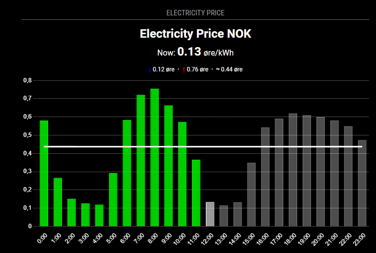
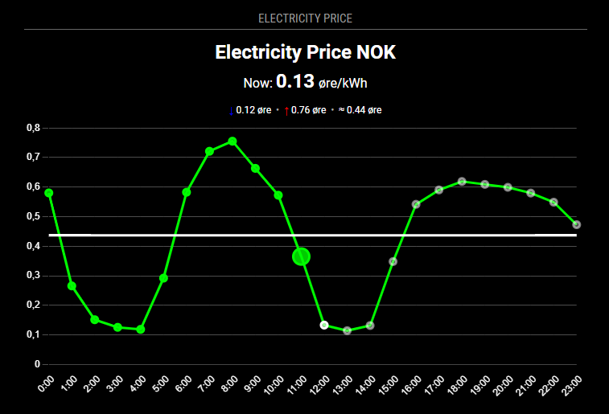

# MMM-EUElectricityPrice
### Breaking update! Oct. 15th 2024
Because of changes in Nordpool API some existing users need to correct their datasource.

Please check : https://data.nordpoolgroup.com/map?deliveryDate=latest&currency=EUR&market=DayAhead&mapDataType=Price&resolution=60
for your updated code.

Thank you JanneKalliola for creating this great module, in need for Norwegian data on my MagicMirror i've forked his work and added possiblity for EU data. 
Magic Mirror Module to display EU electricity prices from Nord Pool.

The module loads the electricity prices when started and then every day at time set with "tomorrowDataTime" default is 1pm local time of your MagicMirror installation. The prices are shown as a bar chart with optional average value and highlights for high and low prices, both limits are configurable.

The module reads the data that is shown on this page: https://data.nordpoolgroup.com/auction/day-ahead/prices?deliveryDate=latest&currency=EUR&aggregation=Hourly&deliveryAreas=EE,LT,LV,AT,BE,FR,GER,NL,PL,DK1,DK2,FI,NO1,NO2,NO3,NO4,NO5,SE1,SE2,SE3,SE4,SYS

## Bar chart

## Line chart

## Installation

Clone this repository in your modules folder, and install dependencies:

    cd ~/MagicMirror/modules 
    git clone https://github.com/late4marshmellow/MMM-EUElectricityPrice
    cd MMM-EUElectricityPrice
    npm install 

## Configuration

Go to the MagicMirror/config directory and edit the config.js file. Add the module to your modules array in your config.js.

Enter as minimimum these details in the config.js for your MagicMirror installation:

        {
            module: "MMM-EUElectricityPrice",
            position: "top_right",
            config: {
	    	headText: 'Electricity Price',
	    	dataSource: 'NO1', 
      	currency: 'NOK', 
		    chartType: 'bar', //can be 'bar' or 'line' (line looks good when module is placed in e.g 'bottom_center')
     
            }
        },

## Module configuration
The module has the following configuration options:

<table>
  <thead>
    <tr>
      <th>Option</th>
	  <th>Default</th>
      <th>Description</th>
    </tr>
  </thead>
  <tbody>
    <tr>
      <td><code>dataSource</code></td>
      <td><code>NO1</code></td>
      <td>The URL where to load the data. Nord Pool lists the available pages here: https://data.nordpoolgroup.com/map?deliveryDate=latest&currency=EUR&market=DayAhead&mapDataType=Price&resolution=60 </td>
    </tr>
	<tr>
      <td><code>chartType</code></td>
      <td><code>bar</code></td>
      <td>Choose between line or bar type chart</td>
    </tr>
    <tr>
      <td><code>loadingMessage</code></td>
      <td><code>Loading Data...</code></td>
      <td>The message to be shown while the data is loaded from the Nord Pool API.</td>
    </tr>
    <tr>
      <td><code>errorMessage</code></td>
	  <td><code>Data could not be fetched.</code></td>
      <td>The error message to be shown if the data loading failed due to an error.</td>
    </tr>
    <tr>
      <td><code>showPastHours</code></td>
	  <td><code>24</code></td>
      <td>The amount of past hours to show.</td>
    </tr>
    <tr>
      <td><code>showFutureHours</code></td>
	  <td><code>36</code></td>
      <td>The amount of future hours to show.</td>
    </tr>
    <tr>
      <td><code>hourOffset</code></td>
	  <td><code>1</code></td>
      <td>The number of hours to offset the Nord Pool times that are given in CET/CEST. Value 1 corrects the time to Finland and the Baltics, 0 works for countries in the CET/CEST timezone, and -1 for countries in GMT.</td>
    </tr>
    <tr>
      <td><code>priceMultiplier</code></td>
	  <td><code>1</code></td>
      <td>The price will be multiplied with this multiplier. Useful for adding value added tax and like to the price. The <code>priceOffset</code> will be added after multiplication. <b>ex. 25% VAT is entered as 1.25</b></td>
    </tr>
    <tr>
      <td><code>priceOffset</code></td>
	  <td><code>0</code></td>
      <td>The amount in currency to add on top of the price. You can use this to add the transfer cost, comission and other costs to get the final price you are paying. ex 7.13 øre surcharge and 50 øre grid fee is entered as <b>0.5713</b> </td>
    </tr>
    <tr>
      <td><code>showAverage</code></td>
	  <td><code>false</code></td>
      <td>Flag to control whether the average price over seven days (future and past) is shown as a line on top of the bars.</td>
    </tr>
    <tr>
      <td><code>averageColor</code></td>
	  <td><code>#fff</code></td>
      <td>The color of the average line. Hexadecimals and rgba values, such as <code>rgba(255, 255, 255, 0.8)</code>, are allowed.</td>
    </tr>
    <tr>
      <td><code>showGrid</code></td>
	  <td><code>true</code></td>
      <td>Flag to control showing the grid lines.</td>
    </tr>
    <tr>
      <td><code>gridColor</code></td>
	  <td><code>rgba(255, 255, 255, 0.3)</code></td>
      <td>The color of the grid lines.</td>
    </tr>
    <tr>
      <td><code>labelColor</code></td>
	  <td><code>#fff</code></td>
      <td>The color of the axis labels.</td>
    </tr>
    <tr>
      <td><code>tickInterval</code></td>
	  <td><code>false</code></td>
      <td>The interval between ticks (hours on the grid). Default is <code>false</code> to use automatic algorithm. The calculation is based on the hour value, for example, <code>3</code> shows hours 0:00, 3:00, 6:00, etc., and <code>4</code> shows hours 0:00, 4:00, 8:00, etc.</td>
    </tr>
    <tr>
      <td><code>pastColor</code></td>
	  <td><code>rgba(255, 255, 255, 0.5)</code></td>
      <td>The border color of the past hour bars.</td>
    </tr>
    <tr>
      <td><code>pastBg</code></td>
	  <td><code>rgba(255, 255, 255, 0.3)</code></td>
      <td>The fill color of the past hour bars.</td>
    </tr>
    <tr>
      <td><code>currentColor</code></td>
	  <td><code>#fff</code></td>
      <td>The border color of the current hour bar.</td>
    </tr>
    <tr>
      <td><code>currentBg</code></td>
	  <td><code>#fff</code></td>
      <td>The fill color of the current hour bar.</td>
    </tr>
    <tr>
      <td><code>futureColor</code></td>
	  <td><code>rgba(255, 255, 255, 0.8)</code></td>
      <td>The border color of the future hour bars.</td>
    </tr>
    <tr>
      <td><code>futureBg</code></td>
	  <td><code>rgba(255, 255, 255, 0.6)</code></td>
      <td>The fill color of the future hour bars.</td>
    </tr>
    <tr>
      <td><code>alertLimit</code></td>
	  <td><code>false</code></td>
      <td>The limit in euro cents or <code>average</code> to set the lower limit for pricier hours. The limit is not used when the value is set to <code>false</code>.</td>
    </tr>
    <tr>
      <td><code>alertColor</code></td>
	  <td><code>rgba(255, 0, 0, 1)</code></td>
      <td>The border color of the alert hour bars.</td>
    </tr>
    <tr>
      <td><code>alertBg</code></td>
	  <td><code>rgba(255, 0,0, 0.8)</code></td>
      <td>The fill color of the alert hour bars.</td>
    </tr>
    <tr>
      <td><code>safeLimit</code></td>
	  <td><code>false</code></td>
      <td>The limit in euro cents or <code>average</code> to set the upper limit for inexpensive hours. The limit is not used when the value is set to <code>false</code>.</td>
    </tr>
    <tr>
      <td><code>safeColor</code></td>
	  <td><code>rgba(255, 0, 0, 1)</code></td>
      <td>The border color of the safe hour bars.</td>
    </tr>
    <tr>
      <td><code>safeBg</code></td>
	  <td><code>rgba(255, 0,0, 0.8)</code></td>
      <td>The fill color of the safe hour bars.</td>
    </tr>
    <tr>
      <td><code>updateUIInterval</code></td>
	  <td><code>300</code></td>
      <td>The interval, in seconds, to update the UI. Updating the UI does not fetch the data from the network again, it just draws the UI to change the current hour.</td>
    </tr>
  </tbody>
</table>

## Changelog

**2024-10-16** Updated to fit new Nordpool API, error message on screen when wrong datasource or currency is entered.

**2022-09-04** Initial version

**2025-10-05** Updatetd to fit new 15-min intervall, updated chart.js to v4 for new installs, fallback to v3 for pull requests
added a switch between quarter and hourly pricing on chart. 